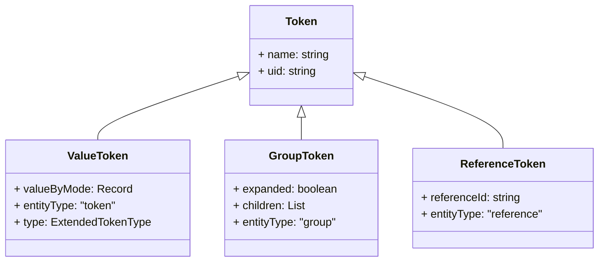
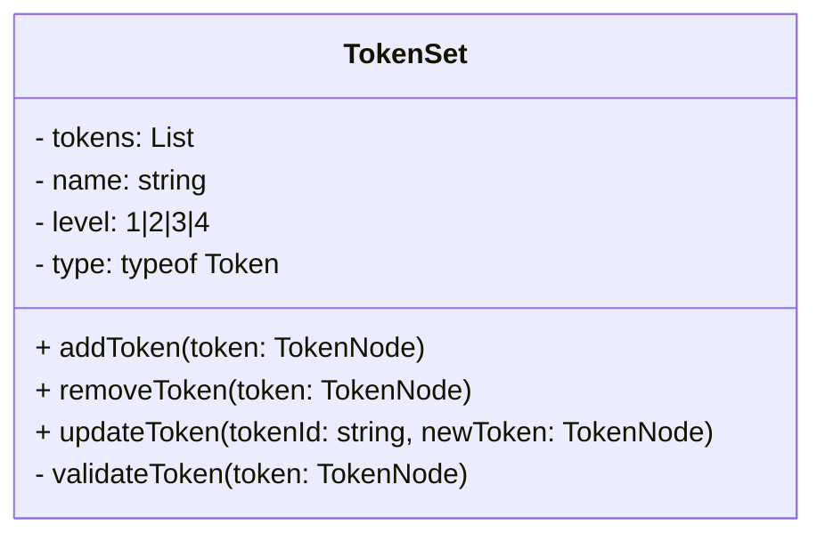

# TokenNode Diagram

```mermaid
classDiagram
class Token {
    + name: string
    + uid: string
}

Token <|-- ValueToken

class ValueToken {
    + valueByMode: Record<string, ExtendedTokenType>
    + entityType: "token"
    + type: ExtendedTokenType
}

Token<|-- GroupToken

class GroupToken {
    + expanded: boolean
    + children: List<ValueNode|ReferenceNode|TokenNode>
    + entityType: "group"
}

Token<|-- ReferenceToken
class ReferenceToken {
    + referenceId: string
    + entityType: "reference"
}

```

# Tokenset

```mermaid
classDiagram
class TokenSet {
    - tokens: List<Token>
    - name: string
    - level: 1|2|3|4
    - type: typeof Token

    + addToken(token: TokenNode)
    + removeToken(token: TokenNode)
    + updateToken(tokenId: string, newToken: TokenNode)
    - validateToken(token: TokenNode)
}
```
